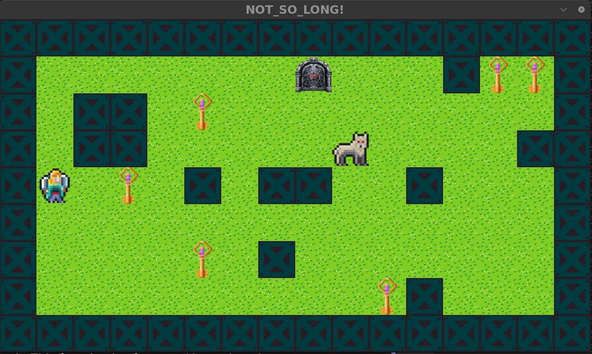

# so_long




## Goals
This project is a very small 2D game designed to help you work with textures, sprites, and some basic gameplay elements. The game also enhances your understanding of game loops, event handling, and memory management in C.

## Getting Started
* To build and run the game, use the following commands:

```sh
make
./so_long [MAP_FILE.ber]
```

Only map files with the .ber extension are supported. Example map files can be found in the maps/ directory.

Example usage:
```sh
./so_long maps/map.ber
```
Running this command will start the game with the specified map.

## How to Play
The objective of the game is to collect all the collectibles on the map and reach the exit with minimal movement.


## Controls
| Keyboard | Action           |
|----------|-----------------|
| W, ↑    | Move up         |
| S, ↓    | Move down       |
| A, ←    | Move left       |
| D, →    | Move right      |
| ESC ⎋   | Close the game window |